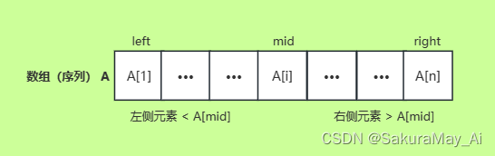
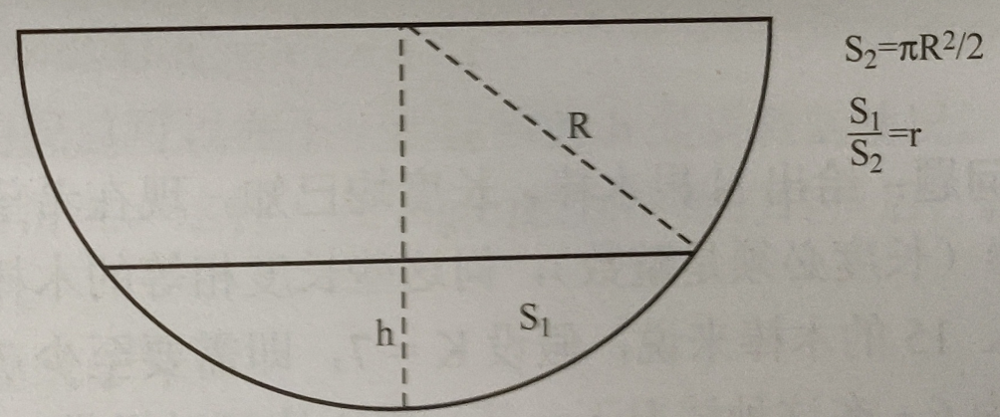

# 1 二分查找
## 1.1 严格递增/递减数组的二分查找

**二分查找解决的问题** ：如何在一个严格递增/递减数组（序列） `A` 中找出给定的数 `x`。可以将二分查找理解成一个将区间不断压缩直到“夹出”待查找元素下标的过程。二分查找**只适用于有序的数组**，不能用于无序的数组。

基本过程：令闭区间 `[left, right]` 为查找区间，计算其中间位置 `mid = (left + right) / 2`（向下取整），然后比较 `A[mid]` 与待查找元素 `x` 的大小。

 - 如果 `x == A[x]`，说明查找成功，返回 `x` 的下标，退出查找；
 - 如果 `x < A[mid]`，需要往左子区间 `[left, mid - 1]` 继续查找；
 - 如果 `x > A[mid]`，需要往右子区间 `[mid + 1, right]` 继续查找。

具体如下图所示：



二分查找的高效之处在于，每一步查找都可以去除当前区间中的一半元素，因此其时间复杂度是 $O(log_2n)$。

## 1.2 严格递增数组的二分查找算法代码

```cpp
// 数组 A 为严格递增数组，left 为左边界，right 为右边界，x 为待查找元素
// 二分查找的过程与数组下标从0开始还是从1开始无关，只需传入左右边界即可
int BinarySearch(int A[], int left, int right, int x)
{
    int mid;
    while (left <= right) // 如果 left > right 就没办法形成闭区间了
    {
        mid = (left + right) / 2;
        if (x == A[mid]) return mid;	// 查找成功，返回下标
        else if (x < A[mid])
            right = mid - 1;    // 往左子区间 [left, mid - 1] 查找
        else left = mid + 1;    // 往右子区间 [mid + 1, right] 查找
    }
    
    return -1;	// 不存在元素 x，返回-1
}
```

之所以采用 `left <= right` 作为循环条件，是因为存在 `left = right` ，即两者指向同一个元素的情况：

- 如果这个元素刚好等于 `x`，那么返回的下标 `mid` 就是上左边界，不加等号就会导致遗漏这种情况；
- 如果它不等于 `x`，要么 `left` 变大，要么 `right` 变小，此时的 `[left, ritht]` 就构不成一个查找区间了，从而循环结束。

需要注意的是，如果 `right` 超过了其数据类型**最大值的一半**，那么当待查找元素在数组比较靠后的位置时，语句 `mid = (left + right) / 2` 有可能会溢出，改成 `mid = left + (right - left) / 2` 即可解决。

## 1.3 非严格递增/递减数组的二分查找

如果将数组 `A` 变成一个**非严格递增/递减（即其中的元素可能重复）** 的数组，问题就可以转化为：求出数组中**第一个大于等于** `x` 的元素的位置 `L`，以及**第一个大于** `x` 的元素的位置 `R`。换句话说：求一个左闭右开的区间 `[L, R)`，其中的元素均等于 `x`，而 `A[R]` 大于 `x`。

### 1.3.1 第一个问题：求出第一个大于等于 `x` 的元素的位置 `L`

此问题依然可以通过二分查找解决，只是在区间的选择上会有所改变。因为我们要找出第一个大于等于 `x` 的元素，有可能等于 `x` 的元素不止一个，所以不再需要单独判断 `x == A[mid]` ，而是将其合并到 `x < A[mid]` 中，改为 `x <= A[mid]`。

原因在于，当 `x = A[mid]` 时，我们不能确定 `A[mid]` 是否为第一个符合要求的元素。有可能在 `A[mid]` 的左侧还存在符合要求的元素，因此不能在 `x = A[mid]` 后直接返回，而是前往**左子区间**继续查找。也就是说，需要修改右边界 `right`。而考虑到 `A[mid]` 仍然有可能是第一个符合要求的元素，所以应该将 `right` 修改为 `mid` 而不是 `mid - 1`。

而当 `x > A[mid]` 时，要寻找的元素显然在 `A[mid]` 的右侧，所以需要修改左边界 `left` 为 `mid + 1`。

有一点要注意，在循环判断中不能带等于号。因为我们实际上并不关心 `x` **是否真的在数组中**，我们需要的只是**第一个大于或等于** `x` 的元素的位置。因此，即便 `x` 不在数组中，算法仍要返回一个“假如 `x` 存在，它应该所处的位置”。于是当 `left = right` 时，`[left, right]` 表示的位置既是最终的结果，也是循环结束的条件。

考虑**待查找元素大于数组中所有元素**的情况：二分查找会不断地前往右子区间。当 `mid = left = right` 时，由于 `x` 仍然大于 `A[mid]`，所以执行 `left = mid + 1 = right + 1`。在下一轮循环中因为 `left > right` 循环结束，函数返回 `left = right + 1`。因此，初识初始区间必须覆盖到所有可能的返回结果。

### 1.3.2 算法代码

```cpp
// 数组 A 为严格递增数组，left 为左边界，right 为右边界，x 为待查找元素
// 二分查找的过程与数组下标从0开始还是从1开始无关
int LowerBound(int A[], int left, int right, int x)
{
    int mid;
    while (left < right)
    {
        mid = (left + right) / 2;       // mid 为中间位置
        if (x <= A[mid]) right = mid;	// 往左子区间 [left, mid] 查找
        else left = mid + 1;            // 往右子区间 [mid + 1, right] 查找
    }
    
    return left;
}
```

### 1.3.3 第二个问题：求出第一个大于 `x` 的元素的位置 `R`

此问题的解法和前一个几乎一致，区别是在这里，我们不能将 `x = A[mid]` 这种情况并入到 `x < A[mid]` 中了。因为我们要找的是第一个大于 `x` 的元素的位置 `R`，当 `x = A[mid]` 时，`A[mid]` 显然不符合题目的要求。所以我们需要修改左边界 `left` 为 `mid + 1`，前往**右子区间**继续查找。

而当 `x < A[mid]` 时，同样考虑到 `A[mid]` 仍然还有可能是第一个符合要求的元素，我们应该将右边界 `right` 修改为 `mid` 而不是 `mid - 1`。

### 1.3.4 求出第一个大于 x 的元素位置的二分查找算法代码
```cpp
// A[] 为严格递增数组，left 为左边界，right 为右边界，x 为待查找元素
int UpperBound(int A[], int left, int right, int x)
{
    int mid;
    while (left < right)
    {
        mid = (left + right) / 2;		// mid 为中间位置
        if (x < A[mid]) right = mid;	// 往左子区间 [left, mid] 查找
        else left = mid + 1;			// 往右子区间 [mid + 1, right] 查找
    }
    
    return left;
}
```

### 1.3.5 总结
不论是 `LowerBound` 函数还是 `UpperBound` 函数，其实都在解决这样一个问题：寻找**非严格递增/递减数组**中**第一个**满足**某条件**的元素的**位置**。这是一个非常重要且经典的问题，平时能碰到的大部分二分法问题都可以归结于这个。下面是解决此类问题的算法模版代码。所谓的 “某条件” 在数组中一定是**从左到右先不满足，然后满足**。

```cpp
// 二分区间为左闭右闭的 [left, right]，必须能覆盖所有可能的取值
int Solve(int left, int right)
{
    int mid;
    while (left < right)    // 对查找区间来说，left == right 意味着找到唯一位置
    {
        mid = (left + right) / 2;   // mid 为中间位置
        if (/*条件成立*/)            // 条件成立，则第一个满足条件的元素的位置 <= mid
            right = mid;            // 往左子区间 [left, mid] 查找
        else                        // 条件不成立，则第一个满足条件的元素的位置 > mid
            left = mid + 1;         // 往右子区间 [mid + 1, right] 查找
    }

    return left;
}
```
该问题还存在一个**镜像问题**：寻找**有序数组**中**最后一个**满足**某条件C**的元素的**位置**。此时我们只需求出第一个满足条件 **!C** 的元素的位置 `pos`，最后一个满足某条件 C 的位置就是 `pos - 1`。

# 2 二分法的实际应用

## 2.1 函数求根问题

给定一个定义在 $[L, R]$ 上的单调函数 $f(x)$，求方程 $f(x) = 0$ 的根，假设精度要求为 $eps = 10^{-5}$。

这种问题就可以用二分法来解决。因为函数 $f(x)$ 在 $[L, R]$ 上单调递增，所以可以将函数值当做一个**严格递增数组**，令 $left$ 和 $right$ 的初值分别为 $L$ 和 $R$，然后根据中间位置的函数值 $f(mid)$ 与 0 的大小关系来判断应往哪个子区间继续逼近 $f(x) = 0$ 的根：

- 如果 $f(mid)>0$，说明 $f(x) = 0$ 的根在 $mid$ 左边，应往 $[left, mid]$ 继续逼近，令 $right = mid$；
- 如果 $f(mid)<0$，说明 $f(x) = 0$ 的根在 $mid$ 右边，应往 $[mid, right]$ 继续逼近，令 $left = mid$。

需要注意的是，因为涉及的是到函数问题，我们的二分的对象是定义域，是一个实数域。所以在二分后，采取的是直接令左边界**等于 mid**，而不再进行加一或减一的操作。这不同于操作数组的下标，请仔细思考其中的区别。

```cpp
const double eps 1e-5;   // 精度为10^-5
double f(double x)          
{
    /*
    ・・・
    */
    return value;   // 返回 f(x) 的值
}

double Solve(double L, double R)
{
    double left = L, right = R, mid;
    while (right - left > eps)  // 当 right - left <= 10^-5 时结束循环
    {
        mid = (left + right) / 2;
        if (f(mid) > 0)         // 如果 f(x) 是单调递减函数，此处改为 f(mid) < 0
            right = mid;        // 往左子区间 [left, mid] 逼近
        else left = mid;        // 往右子区间 [mid, right] 逼近
    }

    return mid;     // 结束循环后的 mid 即为 f(x) = 0 的根
}
```

## 2.2 装水问题

有一个侧面看上去是半圆的储水装置，该半圆的半径为 $R$，要求往里面装入高度为 $h$ 的水，使其在侧面看去的面积 $S_1$ 与半圆面积 $S_2$ 的比例恰好为 $r$。如图所示，现在给定 $R$ 和 $r$，求高度 $h$，假设精度要求为 $eps = 10^{-5}$。



显然，随着水面升高，面积比例 $r$ 一定是增大的。所以不妨这么做：在 $[0, R]$ 范围内对水面高度 $h$ 进行二分，计算在高度 $h$ 下的面积比例 $ratio$ 的值。

 - 如果 $ratio > r$，说明高度过高，应该减小高度（缩小右边界）；
 - 如果 $ratio < r$，说明高度过低，应该增大高度（增大左边界）。

```cpp
const double PI = acos(-1.0);   // 圆周率
const double eps = 1e-5;        // 精度
double f(double R, double h)	// 计算 r = f(h)，由实际含义可知 r 关于 h 递增
{
    double alpha = 2 * acos((R - h) / R);
    double L = 2 * sqrt(R * R - (R - h) * (R - h));
    double S1 = alpha * R * R / 2 - L * (R - h) / 2;
    double S2 = PI * R * R / 2;
    return S1 / S2;
}

double Solve(double R, double r)
{
    double left = 0, right = R, mid;
    while (right - left > eps)
    {
        mid = (left + right) / 2;
        if (f(R, mid) > r)  // 同样是实数域，所以不要加一减一
            right = mid;
        else left = mid;
    }
	
	return mid;
}
```

## 2.3 木棒切割问题

给出 $N$ 根木棒，长度均已知，现在希望通过切割它们来得到**至少** $K$ 段长度为 $L$ 的木棒（长度必须是整数），求 $L$ 可以取到的**最大值**。

举个栗子，假如有三根长度分别为10、24、15的木棒，如果至少需要得到 $K = 7$ 段长度相等的木棒，那么 $L$ 最长为6。因为它们分别可以提供 $10/6 = 1$ 段, $24/6 = 4$ 段, $15/6 = 2 $段。

首先可以注意到一个结论，如果 $L$ 越大，那么可以得到的木棒段数 $K$ 就越小。从这个角度出发便可以想到解决问题的思路：二分最大长度 $L$，根据当前能分割的木棒数 $k$ 与 $K$ 的大小关系来进行二分。

仔细考虑可以发现，该问题可等价于求**最后一个**满足条件 $k >= K$ 的长度 $L$。由前面可知，它可以转换为求**第一个**满足条件 $k < K$ 的长度 $L$，然后减一即可。所以基本思路是这样的：假设区间为左闭右闭的 $[left, right]$，传入的初值为 $[0, n]$，其中 $n$ 是 $N$ 根木棒中最长的长度。对当前长度 $L$ 来说，木棒段数 $k$ 为 $N$ 根木棒的长度分别除以 $L$ 后的商的和。

 - 如果 $k < K$，说明 $L$ 可能过大，应往减少 $L$（缩小右边界）；
 - 如果 $k >= K$，说明 $L$ 一定过小，则应增大 $L$（增大左边界）。

```cpp
// A[] 为 N 根木棒长度递增排序后的数组
// 该函数计算在长度 L 下切割可得到的木棒数
int GetK(int L)  
{
    int sum = 0;
    for (int i = 0; i < N; ++i)
        sum += A[i] / L;
    return sum;
}

// 二分区间为 [left, right]，传入的初值为 [0, n]
int Solve(int left, int right)
{
    int mid;
    while (left + 1 < right)
    {
        mid = (left + right) / 2;
        if (GetK(mid) < K)
            right = mid;
        else left = mid;
    }
    
    return right - 1;
}
```
## 2.4 快速幂问题

### 2.4.1 递归解决

现在有一个问题：给定三个正整数 $a、b、m(a<10^9, b<10^6,1<m<10^9)$，求 $a^b\%m$。

问题很简单，用一个循环就能做出来，但如果将每个数的范围调整一下，变成：$a、b、m(a<10^9, b<10^{18},1<m<10^9)$，求 $a^b\%m$。再用循环，一般的电脑我觉得都已经算不出来了。

在这里我们需要使用**基于二分思想**的快速幂的做法，因此也常被称为二分幂。快速幂基于以下事实：

 1. 对于任何非零的 $a$，都有 $a^b = a*a^{b-1}$。
 2. 如果 $b$ 是偶数，那么有 $a^b = a^{b/2}*a^{b/2}$。

显然，如果 $b$ 是奇数，总可以在下一步转换为 $b - 1$ 是偶数的情况，而 $b$ 是偶数的情况总可以在下一步转换为 $b/2$ 的情况。这样，在 $log_2(b)$ 级别次数的转换后，就可以把 $b$ 变为0，而任何正整数的0次方都是1。

举个例子，如果需要求 $2^{10}$：

 1. 10为偶数，所以 $2^{10} = 2^5*2^5$。
 2. 5为奇数，所以 $2^5 = 2*2^4$。
 3. 4为偶数，所以 $2^4 = 2^2*2^2$。
 4. 2为偶数，所以 $2^2 = 2^1*2^1$。
 5. 1为奇数，所以 $2^1 = 2*2^0$。
 6. $2^0 = 1$，然后从下往上依次回退计算即可。
 
 这显然是递归的思想，基于此便能得到快速幂的递归写法，时间复杂度为 $log_2(b)$。

```cpp
typedef long long LL;
LL BinaryPow(LL a, LL b, LL m)
{
    if (b == 0) return 1;   // 如果 b 为0，那么 a^0 = 1
    if (b % 2 == 1)         // 如果 b 为奇数，转化为偶数 b - 1
        return a * BinaryPow(a, b - 1, m) % m;
    else					// 如果 b 为偶数，转换为 b / 2
    {
        LL mul = BinaryPow(a, b / 2, m);
        return mul * mul % m;
    }
}
```

当 `b % 2 == 0` 时不能直接返回 `BinaryPow(a, b / 2, m) * BinaryPow(a, b / 2, m)`，而应当算出单个 `BinaryPow(a, b / 2, m)` 之后再相乘。这是因为前者每次都会调用两个 `BinaryPow` 函数，导致时间复杂度变成 $O(2^{log(b)}) = O(b)$。

例如求 `BinaryPow(8)` 时，会变成 `BinaryPow(4) * BinaryPow(4)`，而不是先计算 `BinaryPow(4)` 再乘2。之后，这两个 `BinaryPow(4)` 都会各自变成 `BinaryPow(2) * BinaryPow(2)`，于是就需要求四次 `BinaryPow(2)`；而每个 `BinaryPow(2)` 又会变成 `BinaryPow(1) * BinaryPow(1)`，因此最后需要求8次 `BinaryPow(1)`。

针对不同的题目，有两个细节可能需要注意：

 1. 初始时 `a` 有可能大于等于 `m`，那么需要在进入函数前就让 `a` 对 `m` 取模；
 2. 如果 `m` 为1，可以直接在函数外部特判为0，不需要进入函数来计算（因为**任何整数对1取模一定等于0**）。

### 2.4.2 迭代解决

对 $a^b$ 来说，如果把 $b$ 写成二进制，那么 $b$ 就可以写成若干二次幂之和。例如13的二进制是1101，于是3号位、2号位、0号位就都是1，那么就可以得到 $13=2^3+2^2+2^0 = 8 + 4 + 1$，所以 $a^{13} = a^{8+4+1} = a^8 * a^4*a^1$。

同理，我们可以把任意的 $a^b$ 表示成 $a^{2^k}、...\  、a^8、a^4、a^2、a^1$ 中若干项的乘积。其中，如果 $b$ 的二进制的 $i$ 号位为1，那么 $a^{2^i}$ 就被选中。于是可以得到计算 $a^b$ 的大致思路：令 $i$ 从0到 $k$ 枚举 $b$ 的每一个二进制位，如果当前位为1，那么累积 $a^{2^i}$。注意到 $a^{2^k}、...\  、a^8、a^4、a^2、a^1$ 的前一项总是等于后一项的平方，因此具体实现的时候可以这么做：

 1. 初始令 `ans` 等于1，用来存放累积的结果；
 2. 判断 `b` 的二进制位末尾是否为1（即判断 `b & 1` 是否为1，也可以理解为判断 `b` 是否为奇数），如果是的话，令 `ans` 乘上 `a` 的值；
 3. 将 `a` 平方，并将 `b` 右移一位（也可以理解为将 `b` 除以2），倒数第二位转为末位；
 4. 只要 `b` 大于0，就返回2。

```cpp
LL BinaryPow(LL a, LL b, LL m)
{
    LL ans = 1;
    while (b > 0)
    {
        if (b & 1)
            ans = ans * a % m;	// 令 ans 累积上 a
        a = a * a % m;			// 将 a 平方
        b >>= 1;				// 或写成 b = b >> 1 或 b = b / 2
    }
    return ans;
}

```
当 $b$ 等于13时，可以得到下表所示的模拟过程，b&1 用于判断 $b$ 的二进制末位。
|b|b&1| ans | $a$ |
|--|--|--|--|
|  |  | 1 | $a$ |
| 1101 | 1 | $1 * a = a$ | $a^2$ |
| 110 | 0 | $a$ | $a^4$ |
| 11 | 1 | $a * a^4 = a^5$ | $a^8$ |
| 1 | 1 | $a^5 * a^8 = a^{13}$ |  |

在实际应用中，递归写法和迭代写法在效率上的差别不那么明显。
