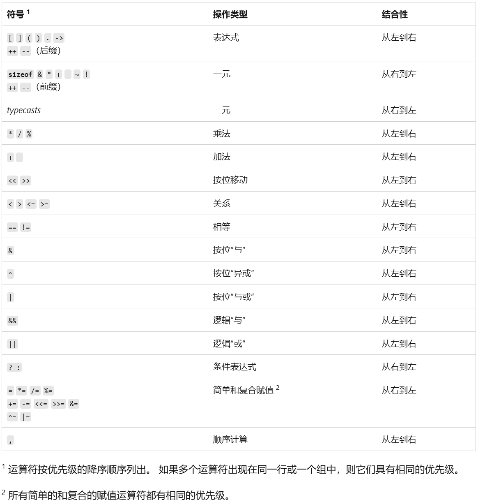

# 1 前言

## 1.1 定义十六进制和八进制的数

在 C/C++ 中，如果要把一个数定义成十六进制数，需要在前面加上 `0x` 前缀。比如下面的代码就会将整数 `n` 解释成一个十六进制的数。

```cpp
int n = 0x1011; // 十六进制的 1011（注意不是二进制）
```

由于定义上的迷惑性，很多人会将该语句理解成：“定义了一个二进制数 `1011`”，这是错误的。因为 `0x` 是十六进制数的前缀，这代表 `n` 的每一位都是**十六进制位**，而不是二进制位。因此十六进制数 `1011` 实际的二进制形式是 `0001 0000 0001 0001`。

同理，如果要定义八进制数，需要在前面加上 `0(数字0)` 前缀。比如下面的代码就会将 n 解释成一个八进制的数。

```cpp
int n = 0305;   // 八进制的 305，二进制是 0011 0000 0101
```
在 C/C++ 中，**1个十六进制位**代表**4个二进制位**，**1个八进制位**代表**3个二进制位**。因为定义这两个进制的数时，要注意位数。比如32个二进制位所能表示的**最大十六进制整数**是 `0xFFFFFFFF`，而**最大十六进制整数**是 `037777777777`。

## 1.2 打印八进制数和十六进制数

在 C 和 C++ 中打印八进制数和十六进制数的方式各不相同。

### 1.2.1 打印十六进制

在 C 中通过**格式控制符** `%x` 和 `%#x` 打印十六进制数，区别是**前者不带前缀**，**后者带前缀**。`x` 如果是大写，则打印出来的字母全大写。

```cpp
int n = 0x10ff;
printf("%x", n);    // 打印：10ff
printf("%#x", n);   // 打印：0x10ff
printf("%X", n);    // 打印：10FF
printf("%#X", n);   // 打印：0X10FF
```

在 C++ 中通过内联函数 `hex` 打印十六进制数。要注意的是，加上 `hex` 后，会将输出流 `cout` 的基数设置为十六进制，从而后续所有的整数都会转为十六进制数打印（在 `hex` 之前的不会被影响）。比如下面的代码，即便 `cout << m;` 没有加 `hex`，也会将 `m` 转为十六进制后打印，而 `p` 则不会被影响。解决办法就是加上 `dec` 函数改回十进制显示。

```cpp
int p = 500;
int n = 0x1024; 
cout << p << " " << hex << n << endl;   // 打印：500 1024
int m = 1023;   // 定义十进制数 1023
cout << m;      // 打印：ff
```

### 1.2.2 打印八进制

在 C 中同样可以通过格式控制符 `%o` 和 `%#o` 打印八进制数，其中前者不带前缀，后者带前缀0。注意此时就没有什么大小写之分了，因为八进制数中不含字母。

```cpp
int n = 01024;
printf("%o", n);    // 打印：1024
printf("%#o", n);   // 打印：01024
```

在 C++ 中通过 `oct` 打印八进制数，它同样会改变输出流 `cout` 的打印格式。

```cpp
int n = 01024;
cout << oct << n << endl;   // 打印：1024
int m = 1023;               // 定义十进制数 1023
cout << m;                  // 打印：1777
```

### 1.2.3 进制互转的通用方法

在 C 的标准库中有一个 `sprintf` 函数，函数原型是：`int sprintf(char *str, const char *format, ...)`。它可以将 `...` 中的参数按照 `format` 进行格式化，保存在 `str` 中。因此它也可以用于打印不同的进制。

```cpp
int n = 1024;
char bin_hex[35];
sprintf(bin_hex, "%x", n);  // 将十进制 n 转成十六进制保存在 bin_hex 中
printf("%s", bin_hex);      // 打印：400

int m = 01024;
char bin_dec[35];
sprintf(bin_dec, "%d", m);  // 将八进制 n 转成十进制保存在 bin_dec 中
printf("%s", bin_dec);      // 打印：532
```

## 1.3 打印二进制

### 1.3.1 数的本质

在 C/C++ 中，当你定义一个数后，它就成为了内存中的**一串二进制代码**。选用不同的格式控制符去打印，仅仅只是在**编译器层面**上，改变了编译器**对这一段内存的解释**。打印某数的二进制数，本质就是打印它的内存，但是我们无法仅仅通过**简单的打印控制**来打印内存中的值。所以 C 和 C++ **都不支持直接打印二进制数**，都需要通过库函数来实现。

这里要补充一点：在 C 中**不存在打印二进制数的 `%b` 控制符**，纯属臆想。

### 1.3.2 Windows 下打印二进制的通用方法

在 C/C++ 的 `<stdlib.h>` 库中有一个 `itoa` 函数，函数原型是：`char *itoa(int value, char *string, int radix);`。它可以将指定的整数 `value` 转为指定进制 `radix` 下的数，并将每一**数位**按照**字节**保存在数组 `string` 中。但是要注意，这个函数是 Windows 下特有的，Linux 下无法使用。

```cpp
int n = 1125;
char bin[35];
itoa(n, bin, 2);    // 将 n 转为二进制，保存在 bin 中
printf("%s", bin);  // 打印：10001100101
```

### 1.3.3 C++ 特有的方法

在 C++ 的 `<bitset>` 库中有一个 `bitset<len>(val)` 模版，它可以将指定的整数 `val` 转为指定长度 `len` 的二进制。

```cpp
int n = 1125;
cout << bitset<16>(n);  // 打印：0000010001100101
```

# 2 与、或、异或、取反

在现代计算机中，所有数据都以二进制形式存储，对**二进制位**进行的运算被称为**位运算**。由于直接操作二进制位，所以合理使用位运算可以显著提高程序的执行效率。**与**、**或**、**异或**都是两数间的运算，因此在这里一起总结。

## 2.1 按位与运算 `&`

运算规则如下表所示，总结就是：**有0为0，全1为1**。逻辑与运算 `&&` 同理。

| & | 0 | 1 |
|:-:|:-:|:-:|
| **0** | 0 | 0 |
| **1** | 0 | <font color=Red>1 |

## 2.2 按位或运算 `|`

运算规则如下表所示，总结就是：**有1为1，全0为0**。逻辑或运算 `||` 同理。

| \| | 0 | 1 |
|:-:|:-:|:-:|
| **0** | <font color=Red>0 | 1 |
| **1** | 1 | 1 |

## 2.3 异或运算 `^`

运算规则如下表所示，总结就是：**同0异1**。

| ^ | 0 | 1 |
|:-:|:-:|:-:|
| **0** | <font color=Green>0 | 1 |
| **1** | 1 | <font color=Green>0 |

异或的性质如下：

1. 交换律：`a ^ b = b ^ a`；
2. 结合律：`a ^ (b ^ c) = (a ^ b) ^c`；
3. 保值性：`x ^ 0 = x`；
4. 自反性：`x ^ x = 0`。

由后两个性质可以引申出一个比较重要的运算性质：`a ^ b ^ b = a ^ 0 = a`。

## 2.4 取反运算 `~`

取反运算符比较简单，就是将0变1，将1变0。

## 2.5 常见运算

1. `n & n = n`，`n | n = n`（`n` 为任意整数），即**按位与自己**以及**按位或自己**仍得自己。
1. `n & (-1) = n | 0 = n`（`n` 为任意整数），即**按位与-1**以及**按位或0**仍得自己；
2. `n & 0 = 0`（`n` 为任意整数），即**按位与0**得0；
3. `n | (-1) = -1`（`n` 为任意整数），即**按位或-1**得-1；
4. `~ (-1) = 0`，`~ 0 = -1`，即-1和0可以通过取反相互得到。


# 3 左移和右移

## 3.1 左移运算 `<<`

将一个数的二进制位全部左移若干位，高位丢弃，低位补0。相当于将其**乘以2**，左移 `x` 位就是乘以 $2^x$。

```cpp
int n = 2;
printf("%d", n << 2);  // 乘以 2^2 = 4，打印：4
```

## 3.2 右移运算 `<<`

将一个数的各二进制位全部右移若干位，高位补符号位，低位丢弃。相当于将其**除以2**，右移 `x` 位就是除以 $2^x$。

```cpp
int n = 8;
printf("%d", n >> 2);  // 除以 2^2 = 4，打印：2
```

# 4 位运算应用

## 4.1 置零

由与运算的特性可知，任何数执行 `& 0` 运算都得0，所以可以快速置零。

```cpp
printf("%d", 1024 & 0); // 打印：0
```

## 4.2 获取低位字节

如下定义了整数 `n`，如果想获取**低8位二进制（字节）**，只需要执行 `& 0xff` 运算。获取低4位就是执行 `& 0xf` 运算。

```cpp
// 1239 的二进制为 0100 1101 0111
// 0xff = 0x1111 1111
// 0100 1101 0111 & 0000 1111 1111 = 0000 1101 0111 = 0xd7
// 除了低位没变，高位全部变成了0
int n = 1239;
printf("%#x", n & 0xff);    // 打印：0xd7
```

## 4.3 判断奇偶数

执行 `& 1` 运算可以得到末位的二进制数，从而判断是奇数还是偶数。比如判断奇数的 `if (n % 2 == 1)` `if ((n & 1) == 1)`等价于。`n & 1` 必须加括号，因为 `==` 的优先级更高。

## 4.4 设置指定位为1

如下定义了整数 `n`，如果想把其低8位二进制设置为1，只需要执行 `| 0xff` 运算。

```cpp
// 1239 的二进制为 0100 1101 0111
// 0xff = 0x1111 1111
// 0100 1101 0111 | 0000 1111 1111 = 0100 1111 1111 = 0x4ff
// 低8位全都变为了1
int n = 1239;
printf("%#x", n | 0xff); // 打印：0x4ff
```
## 4.5 翻转指定位

如下定义了整数 `n`，如果想翻转其低8位二进制，只需要执行 `^ 0xf0` 运算。

```cpp
// 1239 的二进制为 0100 1101 0111
// 0xff = 0x1111 1111
// 0100 1101 0111 ^ 0000 1111 1111 = 0100 0010 1000 = 0x428
// 低8位全部进行了翻转
int n = 1239;
printf("%#x", n ^ 0xff); // 打印：0x428
```

## 4.6 交换数值（只能交换整数）

由异或的性质可以高效的交换两个数的值：

```cpp
void Swap(int& a, int& b)
{
    if (a != b)
    {
        a ^= b;
        b ^= a;
        a ^= b;
    }
}
```

结合异或的性质可证明：

1. `a ^= b`。可以得到 `a = a ^ b`；
2. `b ^= a`。可以得到 `b = b ^ a = b ^ (a ^ b) = (b ^ b) ^ a = 0 ^ a = a`；
3. `a ^= b`。可以得到 `a = a ^ b = (a ^ b) ^ a = b ^ (a ^ a) = b ^ 0 = b`。

## 4.7 抹去低位的1

如下定义了整数 `n`，如果想让其最低1位二进制变为0，只需要执行`& ~1` 运算（`~` 的优先级比 `&` 高）。

```cpp
// 1239 的二进制为 0100 1101 0111
// ~1 = 1111 1111 1110
// 0100 1101 0111 ^ 1111 1111 1110 = 0100 1101 0110 = 0x4d6
// 可以看到最低位变成了0
int n = 1239;
printf("%#x", n & ~1);  // 打印：0x4d6
```

`0x4d6` 的十进制是1238。因此有的读者可能就疑惑，这不就是减一操作操作吗，何必还要执行 `& ~1` 操作？这么理解不全面，当这个整数本身就是一个偶数时，末位就是0，执行了这个操作并不会有任何改变。同时，如果执行的是 `& ~3` 操作，其结果是将最低2位二进制变为0，这个时候更不能称之为减一操作。因此，我更愿意将其称为“**抹零**”操作。

## 5.7 取绝对值

若 `n` 为正数，则有 `n >> 31 = 0`，从而 `(n ^ (n >> 31)) - (n >> 31) = (n ^ 0) - 0 = n`，值保持不变；若 `n` 为负数，则 `n >> 31 = -1`，此时需要计算 `n ^ -1`。

在计算机中，参与运算的都是补码。正数的补码就是原码，负数的补码是**除了符号位，所有位翻转后再加1**。-1的原码是 `1000 0001`变成补码为 `1111 1111`。由 *4.5 翻转指定位* 可以知道，异或-1相当于翻转 `n` 的所有二进制位。

举个例子。-78的原码 `1100 1110`，补码是 `1011 0010`。所以有 `(-78) ^ (-1) = 0100 1101`。而78的补码是 `0100 1110`，刚好等于前面异或的结果加1，所以有 `78 - 1 = (-78) ^ (-1)`，也即 `78 = (-78) ^ (-1) + 1`。

由此可以知道异或的结果加上1后，刚好可以转为 `n` 的绝对值。又因为减去-1相当于加上1，所以最终有：`(n ^ -1) - (n >> 31) = (n ^ -1) + 1`，从而可以将 `n` 转变成 `n` 的绝对值。

```cpp
int n = -8;
int m = (n ^ (n >> 31)) - (n >> 31);
printf("%d", m);    // 打印：8
```

## 5.8 求相反数

对于正数，补码就是原码，按位取反再加1得到的就是负数的补码；反过来亦如此。

```cpp
int n = 8;
int m = ~n + 1;
printf("%d", m);    // 打印：-8
```

## 5.9 求二进制数中1的个数

对于任意的数 `n`，转换成二进制后一定可以组成 $x10...00$ 的形式：高位为 $x$, $x$ 由任意的0和1组成；中间一个1；低位全0（个数不限）。

假设低位存在至少一个0，则 `n - 1` 转换成二进制后一定可以组成 $x01...11$ 的形式：高位仍为 $x$，保持不变；中间的1因为借位成了0；低位全1。

此时有 $x\\&(x - 1) = (x10...00)\\&(x01...11) = x00...00$，取出 $x$ 中最低位的1，又可以组成 $x10...00$ 的形式，只不过此时 $x$ 的位数变少了，低位的0位数变多了。

也因此, $x\\&(x - 1)$ 相当于消除了从右往左数的第一个二进制1。每一次循环会消除一个1，循环的执行次数就是二进制数中1的个数。
```cpp
int n = 1022;   // 二进制为 11 1111 1110
int cnt = 0;
while (n)
{
    n = n & (n - 1);
    ++cnt;
}
printf("%d", cnt);  // 打印：9
```

## 5.10 判断两个数的符号是否相同

如果两个数同号，异或后的符号位就是0，结果大于0；反之结果小于0。

```cpp
// 下述代码打印 "NO"
int m = -5, n = 5;
if ((x ^ y) > 0)
    printf("同号");
else printf("异号");
```

## 5.11 获取两个数中的最大值/最小值

如果 `a >= b`，则有 `(a - b) >> 31` 为0，否则为-1。具体的推导就不赘述了。

```cpp
int max(int a, int b)
{
    return (b & ((a - b) >> 31)) | (a & (~(a - b) >> 31));
}
int min(int a, int b)
{
    return (a & ((a - b) >> 31)) | (b & (~(a - b) >> 31));
}
```

# 6 附加微软官方的运算符优先级表

每一层优先级从上往下逐步递减，同一层符号优先级在表的右侧。


